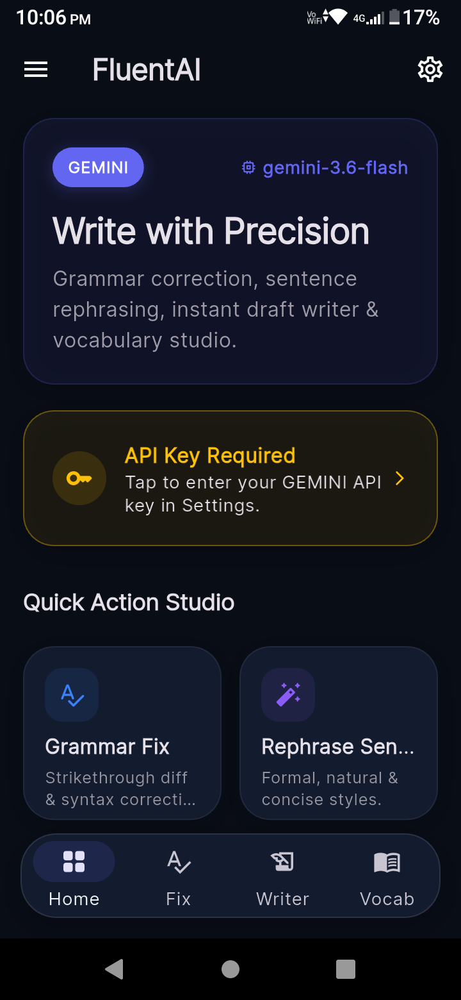
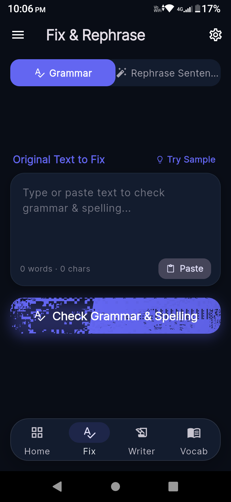
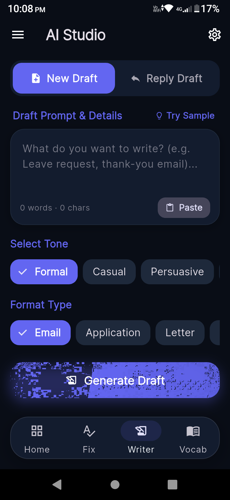
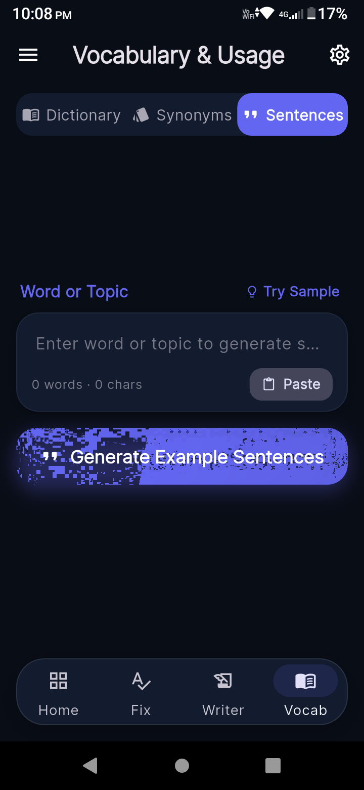
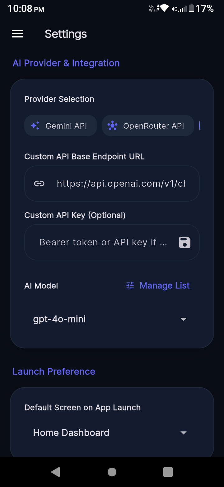

# FluentAI — AI-Powered English Writing Assistant

<p align="center">
  
  <br>
  <b>An ultra-modern, production-quality Flutter Android app for instant grammar correction, sentence rephrasing, draft writing, audio dictionary, and vocabulary mastery.</b>
</p>

<p align="center">
  <a href="https://flutter.dev"></a>
  <a href="https://dart.dev"></a>
  <a href="https://android.com"></a>
  <a href="https://material.io/blog/material-3-is-open-source"></a>
  <a href="#license"></a>
</p>

---

## 📱 App Screenshots

<p align="center">
  
  
  
  
  
</p>

---

## ✨ Features Overview

### 1. ✍️ Grammar & Spelling Correction
- **Diff Visualizer**: Highlights changes with red strikethrough for deleted text and green background for added fixes.
- **Rule Breakdown**: Clear summaries explaining why each correction was made.
- **Sample Helper**: 1-tap sample text button to quickly test grammar checking.

### 2. 🪄 Sentence Rephrasing & Refinement
- Rephrase sentences across 5 distinct target styles: **Natural**, **Formal**, **Concise**, **Academic**, and **Persuasive**.
- Provides a primary suggestion, alternative options, and key structural improvements.

### 3. 📝 AI Draft & Reply Composer
- **Dual Mode**: Switch seamlessly between **New Draft** and **Reply Draft** mode.
- **Tone Selector**: Formal, Casual, Persuasive, Professional, or Friendly.
- **Format Selector**: Email, Job Application, Letter, Essay, or Messaging.
- Generates optional subject lines, complete formatted draft text, and key points covered.

### 4. 📚 Word Dictionary & TTS Audio Pronunciation
- Detailed word lookup featuring IPA phonetics, parts of speech, definition lists, example sentences, and etymology notes.
- **Text-to-Speech (TTS) Speech Playback**: Integrated speaker button (🔊) powered by `flutter_tts` next to word definitions and example sentences for native English audio pronunciation.

### 5. 🔍 Interactive Synonyms & Antonyms
- Chip-style list of synonyms and antonyms.
- **Tappable Chip Search**: Tap any synonym or antonym chip to instantly trigger a new dictionary search for that word.

### 6. 🎓 Multi-Level Sentence Maker
- Generates practical example sentences categorized across 3 difficulty levels: **Beginner**, **Intermediate**, and **Advanced**.

---

## ⚙️ Provider & Integration Settings

- **Multiple AI Providers**:
  - **Google Gemini API**: `gemini-3.6-flash` (default), `gemini-3.5-flash`, `gemini-3.5-flash-lite`, `gemini-3.1-flash-lite`, `gemini-2.5-flash`, `gemini-2.0-flash-exp`.
  - **OpenRouter API**: `openrouter/free` (default free router), `openrouter/auto`, `google/gemma-4-26b-a4b-it:free`, `meta-llama/llama-3.3-70b-instruct:free`, `deepseek/deepseek-r1:free`, `qwen/qwen-2.5-72b-instruct:free`.
  - **Custom / OpenAI API**: Connect to self-hosted Ollama, LocalAI, vLLM, DeepSeek, or OpenAI endpoints (`https://api.openai.com/v1/chat/completions`).
- **Model List Management**:
  - Tap **`+ Add Custom Model...`** directly inside the dropdown to add custom model identifiers that persist across sessions.
  - Tap **`Manage List`** to remove unwanted preset or custom models.
- **Real-Time UI Customization**:
  - Theme mode (System / Light / Dark).
  - Dynamic Accent Color palette picker.
  - Text size scaling slider (0.8x to 1.3x).
  - Google Fonts typography picker (Inter, Poppins, Roboto, Outfit, Lora).
  - Default screen preference on launch.

---

## 🚀 Building & Running

### Prerequisites
- [Flutter SDK](https://docs.flutter.dev/get-started/install) v3.0.0 or higher
- Android Studio / Android SDK

### Steps
1. Clone the repository:
   ```bash
   git clone https://github.com/NetAnkur/fluentai.git
   cd fluentai
   ```
2. Install dependencies:
   ```bash
   flutter pub get
   ```
3. Run on a connected Android device or emulator:
   ```bash
   flutter run
   ```
4. Build Release APK:
   ```bash
   flutter build apk --release
   ```
   The APK will be generated at `build/app/outputs/flutter-apk/app-release.apk`.

---

## 👨‍💻 Developer & Credits

- **Created & Developed by**: **NetAnkur**
- **App Version**: `v1.0.0`
- **Package Name**: `com.ad.fluentai`

---

## 📄 License

This project is licensed under the MIT License — see the [LICENSE](LICENSE) file for details.
